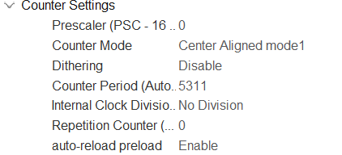
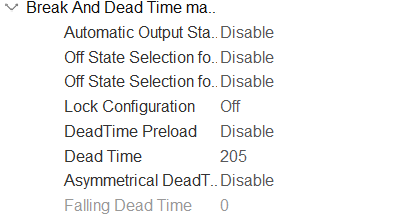
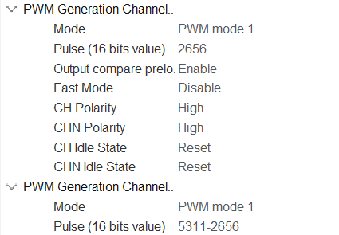

# TP Commande Numérique Directe

Ce code à pour but de commander une MCC en courant et en vitesse grâce à 2
correcteurs PI.

### Composants utilisés
- Nucléo G474-RE
- Power Module dsPICDEM
- MCC 48V/12A

### Objectifs

- Réaliser un shell pour commander le hacheur, sur la base d'un code fourni.
- Réaliser la commande des 4 transistors du hacheur en commande complémentaire décalée.
- Faire l'acquisition des différents capteurs.
- Réaliser l'asservissement en temps réel.

## Commande MCC Basique

- Générer 4 PWM en complémentaire décalée pour contrôler en boucle ouverte le moteur en respectant le cahier des charges,
- Inclure le temps mort,
- Vérifier les signaux de commande à l'oscilloscope,
- Prendre en main le hacheur,
- Câbler correctement la STM32 au hacheur
- Générer le signal de commande "start" en fonction de la datasheet
- Faire un premier essai de commande moteur

### Generation de 4 PWM

Générer quatre PWM à partir du Timer 1 pour controler le hacheur.

 Cahier des charges :
- Fréquence de la PWM : 16kHz
- Temps mort minimum : 2us
- Résolution minimum : 10bits.

#### Reglage du Timer 1
L'hologe du système est de 170 MHz et on souhaite un timer d'une fréquence de
16 kHz. On va donc avoir un ARR=170x10^6/16x10^3-1=10624. Comme le Timer est réglé
en center align, on divise cette valeur par 2 ce qui fait que ARR=5311.

#### Observation a l'oscilloscope

Nos PWM sont bien a 16KHz et complémentaires.

Il y'as bien un temps mort de 2us entre chaques commutations.

## Authors

- [@Erwan Brochot](https://github.com/ErwanBrochot/)

