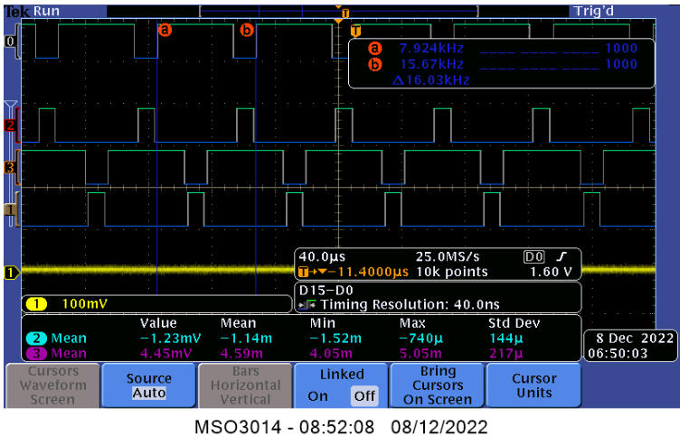
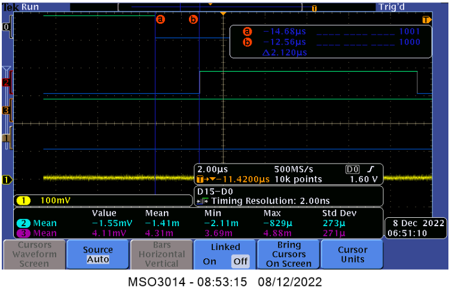
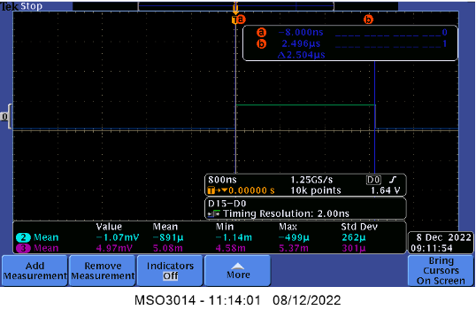
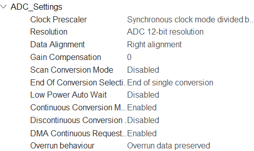

# TP Commande Numérique Directe

Ce code à pour but de commander une MCC en courant et en vitesse grâce à 2
correcteurs PI.

### Composants utilisés
- Nucléo G474-RE
- Power Module dsPICDEM
- MCC 48V/12A

### Objectifs

- Réaliser un shell pour commander le hacheur, sur la base d'un code fourni.
- Réaliser la commande des 4 transistors du hacheur en commande complémentaire décalée.
- Faire l'acquisition des différents capteurs.
- Réaliser l'asservissement en temps réel.


## Commande MCC Basique

- Générer 4 PWM en complémentaire décalée pour contrôler en boucle ouverte le moteur en respectant le cahier des charges,
- Inclure le temps mort,
- Vérifier les signaux de commande à l'oscilloscope,
- Prendre en main le hacheur,
- Câbler correctement la STM32 au hacheur
- Générer le signal de commande "start" en fonction de la datasheet
- Faire un premier essai de commande moteur

### Generation de 4 PWM

Générer quatre PWM à partir du Timer 1 pour controler le hacheur.

 Cahier des charges :
- Fréquence de la PWM : 16kHz
- Temps mort minimum : 2us
- Résolution minimum : 10bits.

#### Reglage du Timer 1
L'hologe du système est de 170 MHz et on souhaite un timer d'une fréquence de
16 kHz. On va donc avoir un ARR=170x10^6/16x10^3-1=10624. Comme le Timer est réglé
en center align, on divise cette valeur par 2 ce qui fait que ARR=5311.

##### Counter setting


##### Deadtime setting


##### PWM setting


#### Observation a l'oscilloscope

#####Observations



Nos PWM sont bien a 16KHz et complémentaires.



Il y'as bien un temps mort de 2us entre chaques commutations.

### Prise en main de hacheur

Ce hacheur comporte 3 bras de ponts, nous n'en utiliserons que 2 pour commander notre MCC. Nous avons décidé de prendre les bras Yellow et Red car ils sont tout deux munis de capteur a effet Hall contrairement au troisième bras de pont.

En suivant la datasheet du hacheur et les pins utilisés sur notre Nucléo. Nous avons établi les connections de telle manière:

|Signal|Pin STM32|Pin hacheur|Correspondance hacheur|
|------|---------|-----------|----------------------|
|TIM1_CH1|PA8|Pin 12|CM_Y_TOP|
|TIM1_CH1N|PA11|Pin 30|CM_Y_BOT|
|TIM1_CH2|PA9|Pin 13|CM_R_TOP|
|TIM1_CH2N|PA12|Pin 31|CM_R_BOT|
|ISO_RESET|PC3|Pin 33 |ISO_RESET|

### Commande powerOn

En s'appuyant sur la datasheet, nous avons codé une fonction qui permet d'intialiser le hacheur en envoyant une impulsion d' au moins 2us. Cette fonction se lance si on entre "power on" dans le Shell ou si on appuie sur le bouton bleu de la Nucleo.

#### Detail de la fonction

```c
void motorPowerOn(void){
	HAL_GPIO_TogglePin(LED_GPIO_Port, LED_Pin); // just for test, you can delete it
	//Phase de démarage//
	HAL_GPIO_WritePin(ISO_RESET_GPIO_Port, ISO_RESET_Pin,GPIO_PIN_SET );
	setAlpha(50);
	HAL_TIM_PWM_Start(&htim1,TIM_CHANNEL_1 );
	HAL_TIMEx_PWMN_Start(&htim1, TIM_CHANNEL_1);
	HAL_TIM_PWM_Start(&htim1,TIM_CHANNEL_2 );
	HAL_TIMEx_PWMN_Start(&htim1, TIM_CHANNEL_2);


	int i=0;
	while (i<33)
	{
		i++;
	}
	HAL_GPIO_WritePin(ISO_RESET_GPIO_Port, ISO_RESET_Pin, GPIO_PIN_RESET);

}
```

Cette fonction commence par mettre le port de ISO_RESET a 1, elle va ensuite initialiser le Timer1 et enfin elle va tourner 34 fois dans une boucle ce qui représente environ 2us avant de remmtre le port ISO_RESET à 0.

Afin d'entrer dans cette fonctions grâce à l'appuie sur le bouton bleu, nous traitons les interruptions venant des GPIO:

```c
void HAL_GPIO_EXTI_Callback(uint16_t GPIO_Pin)
{
	if (GPIO_Pin== BUTTON_Pin)
	{
		motorPowerOn();
	}

}
```

Pour entrer dans la fonction en utilisant le commandShell, nous avons modifié la fonction shellExec pour que la commande power on nous fasse entrer dans motorPowerOn:

```c
void shellExec(void){
	if(strcmp(argv[0],"set")==0){
		if(strcmp(argv[1],"PA5")==0 && ((strcmp(argv[2],"0")==0)||(strcmp(argv[2],"1")==0)) ){
			HAL_GPIO_WritePin(LED_GPIO_Port, LED_Pin, atoi(argv[2]));
			stringSize = snprintf((char*)uartTxBuffer,UART_TX_BUFFER_SIZE,"Switch on/off led : %d\r\n",atoi(argv[2]));
			HAL_UART_Transmit(&huart2, uartTxBuffer, stringSize, HAL_MAX_DELAY);
		}
		else if(strcmp(argv[1],"speed")==0){
			if(atoi(argv[2])==0 && strcmp(argv[2],"0")!=0){
				HAL_UART_Transmit(&huart2, motorSpeedInst, sizeof(motorSpeedInst), HAL_MAX_DELAY);
			}
			else{
				motorSetSpeed(atoi(argv[2]));
			}
		}
		else if(strcmp(argv[1],"alpha")==0){
			setAlpha(atoi(argv[2]));
		}
		else if(strcmp(argv[1],"current")==0){
					consignCurrent=(atof(argv[2]));

				}
		else{
			shellCmdNotFound();
		}
	}

	else if(strcmp(argv[0],"help")==0)
	{
		HAL_UART_Transmit(&huart2, help, sizeof(help), HAL_MAX_DELAY);
	}
	else if(strcmp(argv[0],"pinout")==0)
	{
		HAL_UART_Transmit(&huart2, pinout, sizeof(pinout), HAL_MAX_DELAY);
	}
	else if((strcmp(argv[0],"power")==0)&&(strcmp(argv[1],"on")==0))
	{
		HAL_UART_Transmit(&huart2, powerOn, sizeof(powerOn), HAL_MAX_DELAY);
		motorPowerOn();
	}
	else if((strcmp(argv[0],"power")==0)&&(strcmp(argv[1],"off")==0))
	{
		HAL_UART_Transmit(&huart2, powerOff, sizeof(powerOff), HAL_MAX_DELAY);
		motorPowerOff();
	}
	else{
		shellCmdNotFound();
	}
}
```

#### Test de la fonction

Pour effectuer le test, nous avons utilisé un oscilloscope en mode single trigger pour mesurer la longeur de l'impulsion:



Nous observons ici que notre temps mort est de plus de 2us, nous respectons donc le cahier des charges.

## Capteur de courant et position

### Mesure de courant 

Pour mesurer le courant nous allons utiliser un ADC en mode DMA qui sera connecté a un des capteurs à effet Hall présent sur le hacheur. L'ADC sera cadencé par le Timer 2 qui aura une fréquence de 16kHz. Le DMA remplira un Buffer de 10 valeur et nous ferons la moyenne du courant sur ces 10 valeurs pour avoir notre courant moyen. Cette démarche évite de prendre une mesure de courant erronées, car le courant passant dans le moteur comporte de très grandes variations ,et celles-ci pourront nous géner lors de notre asservissement.

#### Paramètres ADC




## Author

- [@Erwan Brochot](https://github.com/ErwanBrochot/)

